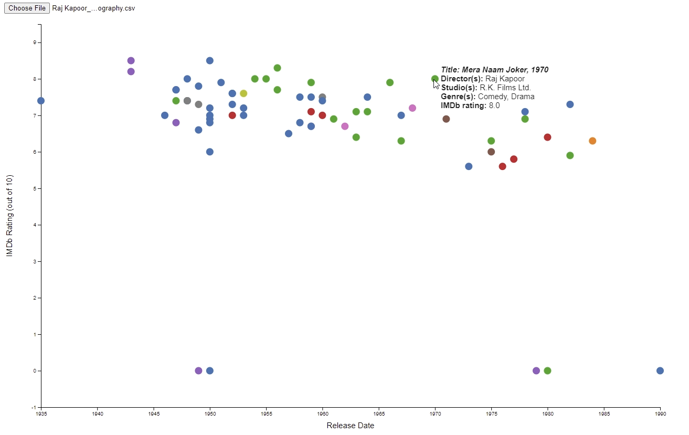

# CWL207 Project
### Title: Interactive Visualization of IMDb Ratings of Actors' Filmographies

### Author: Konstantin Ilin

## Description
_**Note:**_ ``imdbpy`` library needs to be installed to run Python script

This project uses Python script from ``main.py`` to extract the filmography of a specified actor, which is later saved to a ``.csv`` file. Then this file can be opened using ``indian-cinema-visual.html`` to visualize the actor's filmography. The resulting graph provides an insight into how successful an actor's career is (or was) based on IMDb rating.

When positioned over a data entry, the mouse cursor opens a window that shows more detailed information about the selected film. These additional parameters are: _Title, Release Year, Director(s), Studio(s), Genre(s), IMDb Rating_. 

Values of _Release Year_ or _IMDb Rating_ that are unlisted on the IMDb website are set to 0. Values of _Director(s), Studio(s), Genre(s)_ that are unlisted on the IMDb website are set to 'Unknown'.

## Demo

This is the representation of the filmography of Raj Kapoor. 

It perfectly shows that all of the movies Raj Kapoor starred in were well-received, having IMDb Rating between 5.6 and 8.5 (5 movies at the bottom have IMDb Rating unlisted, not 0). 

It also shows years he was active and how the reception of his movies progressed through his career. 

Lastly, the graph classifies movies into different categories based on genre (different colors of entries), allowing us to conclude that Raj Kapoor mostly starred in comedies (green circles) and dramas (blue circles).
